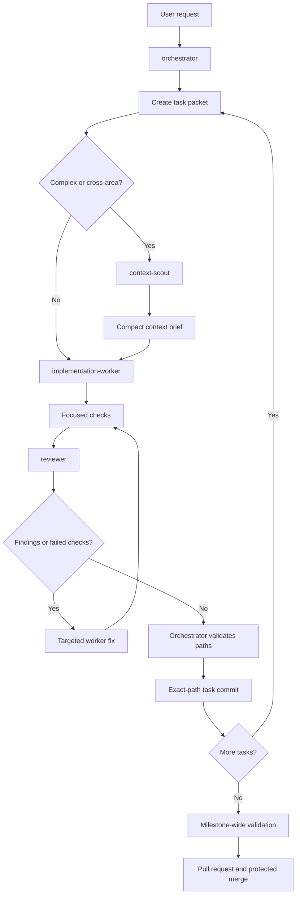
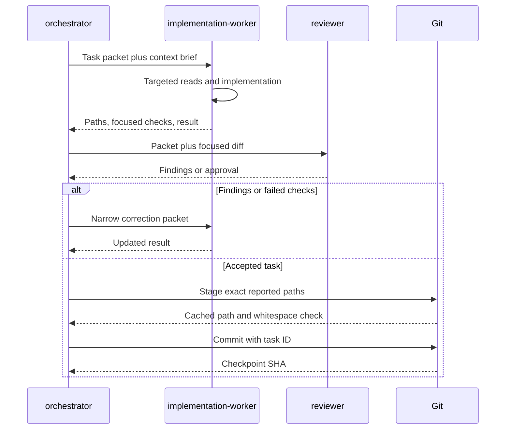

# OpenCode Agents Workflow

This document describes how OpenCode agents collaborate in this repository.
It is a usage guide for the configuration in `opencode.json` and
`.opencode/agent/`. The agent definition files and resolved OpenCode
configuration remain the source of truth when this document and the
configuration disagree.

OpenCode loads agent and configuration changes at startup. Restart OpenCode
after changing an agent definition, `opencode.json`, or a related skill.

## Design Goals

The workflow is designed to:

- Give each worker only the context required for its task.
- Avoid repeated reads of the complete `docs/PLAN.md`, `docs/tasks.md`, and
  repository.
- Keep implementation work explicit, reviewable, and non-recursive.
- Reuse one compact context brief across related workers.
- Create one atomic Git checkpoint for each completed task.
- Preserve unrelated worktree changes, especially `AGENTS.md`.

## Agent Inventory

### Project Agents

These agents are defined under `.opencode/agent/` and form the bounded
delegation workflow.

| Agent | Mode | Visible | Steps | Primary responsibility | Can edit | Can delegate |
|---|---|---:|---:|---|---:|---:|
| `orchestrator` | `primary` | Yes | Not limited by `steps` | Decompose work, prepare packets, coordinate agents, validate results, and create task commits | No | Only the three project agents |
| `context-scout` | `subagent` | No | 6 | Build a compact context brief from assigned files and documentation ranges | No | No |
| `implementation-worker` | `subagent` | No | 16 | Implement one supplied task packet and run focused checks | Yes, within protected paths | No |
| `reviewer` | `subagent` | No | 8 | Review the supplied packet and focused diff with prioritized findings | No | No |

`Visible` refers to the OpenCode agent picker. Hidden agents can still be
called by the orchestrator through the Task tool.

### OpenCode Built-in Agents

OpenCode also provides built-in agents. They are not part of the bounded
project workflow unless explicitly selected.

| Agent | Mode | Intended use | Why it is not the default project worker |
|---|---|---|---|
| `build` | `primary` | General development with broad tools | Its scope is not automatically limited to a task packet |
| `plan` | `primary` | Read-only planning and analysis | It does not implement changes |
| `general` | `subagent` | Complex research or multi-step work | It has broad repository access and can over-read |
| `explore` | `subagent` | Fast read-only repository exploration | It produces discovery, not implementation |
| `scout` | `subagent` | External documentation and dependency research | It is not scoped to this repository's task packets |

The internal `compaction`, `title`, and `summary` agents are OpenCode runtime
agents and are not task workers.

## Agent Details

### `orchestrator`

Definition: `.opencode/agent/orchestrator.md`

Description:

> Coordinates bounded task delegation through repository context briefs and
> focused subagents. Never edits files directly.

Responsibilities:

- Decompose the requested work into independently verifiable tasks.
- Prepare a complete context packet before delegation.
- Use `context-scout` for complex, cross-area, unfamiliar, or ambiguous work.
- Reuse the same context brief across parallel read-only workers.
- Keep implementation workers sequential when they write to the shared worktree.
- Run or delegate focused validation before a task is committed.
- Inspect changed paths and create exact-path task commits.
- Stop and escalate instead of silently expanding scope.

Permissions:

| Capability | Policy |
|---|---|
| File editing | Denied |
| Task delegation | Only `context-scout`, `implementation-worker`, and `reviewer` |
| Skills | Denied |
| Web access | Denied |
| Git inspection | `status`, `diff`, and `log` |
| Git checkpointing | Exact workflow commands for `add` and `commit` |
| Configuration checks | JSON validation and `opencode debug config` |

The orchestrator must not use `git add .`, `git add -A`, wildcard staging,
`reset`, `amend`, force-push, or merge during a task checkpoint.

### `context-scout`

Definition: `.opencode/agent/context-scout.md`

Description:

> Produces a compact, bounded repository context brief for a supplied task
> without changing files or delegating.

Allowed work:

- Read assigned files and direct dependencies.
- Use `glob` and `grep` to locate only packet-approved paths.
- Read exact documentation sections and line ranges listed in the packet.
- Report unknowns instead of inferring requirements from unrelated areas.

Denied work:

- Editing, shell commands, delegation, skills, web access, MCP documentation
  tools, LSP, listing broad directories, and todo management.

Output contract:

- At most 500 words.
- Relevant files and exact sections or ranges.
- Architecture facts needed by the worker.
- Invariants, acceptance criteria, and focused checks.
- Unknowns, conflicts, or blockers.

### `implementation-worker`

Definition: `.opencode/agent/implementation-worker.md`

Description:

> Implements only a supplied bounded task packet, preserving unrelated work and
> returning focused validation results.

Allowed work:

- Edit the task-approved project files.
- Read direct dependencies using targeted searches and reads.
- Run packet-approved focused tests, Ruff, and mypy checks.
- Load only a specifically relevant permitted LangChain or LangGraph skill.

Protected boundaries:

- `AGENTS.md` cannot be edited.
- `.env` and other environment files cannot be read or edited.
- `.git` cannot be edited.
- Recursive task delegation is denied.
- Web and MCP documentation access is denied.
- The worker never switches branches or commits.

Output contract:

- At most 300 words.
- Changed paths.
- Checks and outcomes.
- Acceptance criteria status.
- Unresolved risks or blockers.

### `reviewer`

Definition: `.opencode/agent/reviewer.md`

Description:

> Performs a bounded, read-only review of a supplied task packet and focused
> diff with prioritized file-and-line findings.

Review scope:

- The supplied task packet.
- The context brief.
- The focused diff.
- The packet-approved direct dependencies and checks.

The reviewer must not edit, delegate, load skills, use web or MCP tools, or
inspect unrelated repository areas.

Output contract:

- At most 600 words.
- Findings first, ordered by severity.
- Every finding includes severity and `path:line` references.
- Include impact and a concrete correction when useful.
- If there are no findings, state that explicitly and list residual gaps.

## Configuration Controls

The project-level `opencode.json` provides these controls:

| Setting | Current value | Effect |
|---|---|---|
| `skills.paths` | `.agents/skills` | Uses one canonical project skill path and removes the stale machine-specific path |
| `subagent_depth` | `0` | Prevents subagents from creating more subagents |
| `compaction.auto` | `true` | Allows automatic context compaction |
| `compaction.prune` | `true` | Prunes older tool output during compaction |
| `compaction.tail_turns` | `8` | Retains a short recent conversation tail |
| Global skill permission | `ask` | Skills require explicit approval unless an agent overrides the policy |
| LangChain MCP servers | Enabled globally | Available for approved primary use, but denied to bounded project agents |

The project-configured MCP servers are `docs-langchain` and
`reference-langchain`. The bounded agents deny matching MCP tool names so an
implementation task cannot silently turn documentation research into broad
context loading. `opencode debug config` may also show MCP servers or plugins
from a user's global configuration; those integrations are outside this
repository's project configuration.

## Context Packet

Every non-trivial delegated task receives a packet with concrete values for
all of these fields:

| Field | Required content |
|---|---|
| Task ID and goal | Stable task identifier and one-sentence outcome |
| Allowed paths | Files and directories the worker may inspect or edit |
| Documentation ranges | Exact `PLAN.md`, `tasks.md`, or other sections and line ranges |
| Invariants | Architecture, security, compatibility, and data rules |
| Acceptance criteria | Observable conditions that define completion |
| Focused checks | Tests and static checks for this task only |
| Explicit exclusions | Unrelated milestones, paths, providers, and behaviors |
| Read budget | Maximum targeted reads and lines for the assigned role |
| Output budget | Maximum response size and required result fields |

Default ceilings:

| Role | Targeted reads | Lines | Output |
|---|---:|---:|---:|
| `context-scout` | 8 | 2,000 | 500 words |
| `implementation-worker` | 12 | 5,000 | 300 words |
| `reviewer` | 10 | 3,000 | 600 words |

These are agent workflow ceilings expressed through prompts and step limits,
not a byte-level accounting service. If a worker needs a larger scope, it must
stop and report the reason so the orchestrator can update the packet explicitly.

## Task Handoff Flow



### Handoff Rules

1. The orchestrator sends the packet, not a vague instruction such as "inspect
   the project and implement this."
2. `context-scout` reads only the packet boundary and returns a brief rather
   than copied source or full documentation.
3. The same brief is reused for related workers. Worker-specific paths and
   acceptance criteria are appended rather than rediscovering shared context.
4. A simple one-file task can skip `context-scout`.
5. Read-only discovery and review may run in parallel.
6. Implementation workers that modify the shared worktree run sequentially.
7. A worker that needs an unassigned file, larger budget, prohibited tool, or
   recursive agent must stop and report the boundary conflict.

## Task Commit Checkpoint

The worker never commits. After focused checks and review pass, the
orchestrator creates one commit for the completed task:

```powershell
git status --short
git diff --name-only
git add -- src/research_agent/workflow/state.py tests/unit/test_workflow_state.py
git diff --cached --check
git diff --cached --name-only
git commit -m "feat(m5.1): define workflow state"
```

The actual paths and commit message must come from the task packet. The
orchestrator must verify that:

- No unexpected modified or untracked paths exist.
- Only the task-reported paths are staged.
- `AGENTS.md` is not staged.
- The cached diff passes whitespace checks.
- The commit message contains the task ID.

The next task starts from the new checkpoint commit. A failed task is fixed by
another focused commit; task commits are not amended. Full application checks
run once at the milestone gate unless the task packet requires a narrower
verification.



## Example: Milestone 5

Milestone 5 is the next large milestone and contains explicit LangGraph
workflow, reader, critic, report, recovery, and verification tasks.

The orchestrator should not send all of `docs/PLAN.md` and `docs/tasks.md` to
every worker. A first packet for graph state might look like this:

```text
Task ID: M5.1
Goal: Define typed LangGraph state for request, plan, searches, documents,
evidence, critique, report, usage, errors, and delivery.

Read first:
- docs/PLAN.md lines 138-156
- docs/tasks.md lines 240-251
- Existing model files identified by repository-map.md

Allowed paths:
- workflow state and graph files
- directly related model files
- focused workflow state tests

Invariants:
- Use explicit LangGraph nodes and named graph state.
- Preserve the documented node order.
- Do not create an open-ended autonomous loop.
- Do not alter extraction or Telegram behavior in this task.

Acceptance:
- State is typed and covers the required workflow data.
- Focused tests cover initial and updated state.
- Ruff and mypy pass for changed files.

Exclusions:
- Other milestones
- Full-document reads
- Live provider calls
- Unassigned source paths

Read budget: context-scout 8 reads / 2,000 lines; worker 12 reads / 5,000 lines.
Output budget: scout 500 words; worker 300 words; reviewer 600 words.
```

The scout verifies the actual tree because the repository map lists intended
areas, not proof that every future file exists. The implementation worker then
creates or changes only the packet-approved files, the reviewer checks the
focused diff, and the orchestrator commits `M5.1` before starting `M5.2`.

## Failure And Escalation

| Situation | Required response |
|---|---|
| Packet is missing a required field | Do not delegate; complete or clarify the packet |
| Scout reaches its read budget | Return known facts and list unresolved unknowns |
| Worker needs an unassigned path | Stop and ask the orchestrator to expand the packet explicitly |
| Focused check fails | Send a narrow fix task to the implementation worker |
| Reviewer finds a security or architecture issue | Do not commit; fix and review again |
| Unexpected worktree path appears | Do not stage; inspect and escalate |
| Worker attempts recursion | Denied by permissions; report the violation |
| A task is too broad for one worker | Split it into sequential atomic tasks |

## Repository Context Map

The compact navigation index is `.opencode/context/repository-map.md`. It maps
the application areas to source paths, tests, plan anchors, focused checks, and
configuration-only exclusions. Use it to create packets; do not replace it
with a copy of `docs/PLAN.md`.

`docs/PLAN.md` remains the product and architecture source of truth. Only the
section relevant to the current task should be loaded. `docs/tasks.md` remains
the task status source of truth and should be read at the relevant milestone
range only.

## Maintenance Checklist

When changing this workflow:

- Keep agent descriptions synchronized with their frontmatter.
- Keep permissions and denied paths synchronized with this guide.
- Update the repository map when source ownership or milestone boundaries
  change.
- Validate with `opencode debug config`.
- Validate JSON with `uv run python -m json.tool opencode.json`.
- Run `git diff --check`.
- Do not stage `AGENTS.md` or unrelated worktree changes.
- Restart OpenCode after configuration changes.
