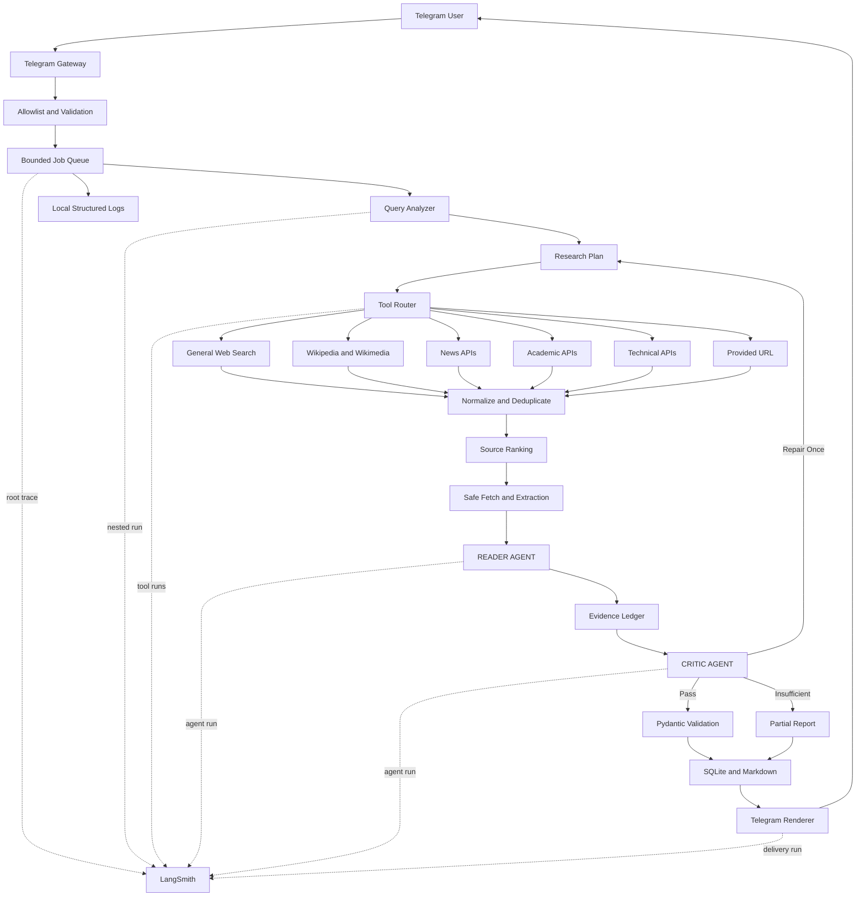

# Deep Research Agent Implementation Plan

## Plan Status

This plan was prepared from the agreed project scope and provider documentation checked on September 10, 2026. Free plans, quotas, model catalogs, and service terms can change; all external providers must therefore be configurable and replaceable.

## 1. Scope

| Area | Decision |
|---|---|
| Users | Small trusted group |
| Interface | Telegram private chats |
| Languages | English and Arabic |
| Inputs | Text queries and URLs |
| Research depth | Automatically selected |
| Domains | General, academic, news, technical, MENA/local, medical, legal, and financial |
| Quality target | Balanced, normally requiring at least three credible independent sources |
| Citations | Inline numbered citations |
| High-stakes topics | Research allowed with authoritative sourcing and warnings |
| Response target | Two to five minutes |
| Concurrency | Two to three jobs globally |
| Expected volume | 10 to 50 requests per day |
| Conversation memory | Temporary session memory |
| Persistence | Reports stored locally |
| Delivery | Telegram summary plus Markdown attachment for long reports |
| Failure strategy | Provider fallback followed by a transparent partial result |
| Production hosting | Oracle Cloud Always Free Ampere A1 VM |
| Containerization | Required Docker image managed with Docker Compose |
| Local runtime | Docker Compose using the same production image |
| Observability | LangSmith tracing and evaluation with local structured-log fallback |
| Version control | Git repository hosted on GitHub |
| Automation | GitHub Actions for CI, container publishing, and production deployment |

## 2. Objectives

Build a Telegram-accessible Deep Research Agent that:

1. Accepts an English or Arabic research query or URL.
2. Determines the topic, locality, freshness requirements, risk level, and appropriate research depth.
3. Generates English and Arabic search variants when useful.
4. Selects specialized and general-purpose research tools.
5. Searches selected sources concurrently within configured quotas.
6. Retrieves and safely extracts the most useful pages.
7. Uses the READER AGENT to convert source material into traceable evidence.
8. Uses the CRITIC AGENT to validate relevance, authority, freshness, corroboration, and citation support.
9. Performs at most one targeted repair-search iteration when evidence is insufficient.
10. Produces a Pydantic-validated report containing Topic, Key Findings, Summary, Sources, and Tools Used.
11. Returns the report through Telegram with inline citations.
12. Retains enough temporary context for follow-up questions.
13. Stores reports locally for later retrieval.
14. Traces the workflow in LangSmith without exposing credentials or sensitive user data.
15. Operates within free-tier quotas and reports degraded operation honestly.
16. Uses Git-based pull requests, automated tests, and reproducible CI/CD before production deployment.
17. Runs as a Dockerized service on an Oracle Cloud Always Free VM in production.

## 3. Non-Goals

The following are outside the MVP scope:

- Voice, image, or uploaded-document analysis.
- Autonomous browsing requiring a full browser.
- Authentication beyond a Telegram numeric user allowlist.
- Public multi-tenant operation.
- Personalized medical, legal, or financial instructions.
- Unlimited or guaranteed availability.
- A distributed worker cluster.
- Training or fine-tuning custom models.
- Full archiving of scraped third-party pages.
- LangSmith-managed application deployment.
- LangSmith as the authoritative report or conversation store.

## 4. Architecture



## 5. Orchestration

Use LangGraph on top of LangChain instead of an unconstrained autonomous agent loop.

This provides:

- Explicit state transitions.
- Conditional tool routing.
- Parallel search execution.
- A hard limit on critique and repair loops.
- Checkpointing and job recovery.
- Native LangSmith tracing.
- Easier unit and integration testing.
- Lower token usage than an open-ended autonomous loop.
- More predictable operation under free-tier quotas.

The graph should contain these logical nodes:

```text
authenticate_request
analyze_query
clarify_query_if_required
build_research_plan
execute_searches
normalize_results
rank_sources
extract_documents
read_evidence
critique_evidence
run_targeted_repair_if_required
generate_report
validate_report
persist_report
deliver_report
```

## 6. Technology Stack

| Concern | Recommended Technology |
|---|---|
| Language | Python 3.12 |
| Agent framework | LangChain and LangGraph |
| Validation | Pydantic 2 and `pydantic-settings` |
| Telegram | `aiogram` 3 |
| HTTP | Asynchronous `httpx` client |
| HTML parsing | BeautifulSoup 4 with `lxml` |
| Retry handling | `tenacity` |
| Database | SQLite with `aiosqlite` |
| Local text search | SQLite FTS5 |
| Cloud observability | LangSmith |
| Local observability | Structured JSON logs and SQLite metrics |
| Testing | `pytest`, `pytest-asyncio`, and `respx` |
| Code quality | Ruff formatting and linting, plus mypy static type checking |
| Package and environment management | `uv` with committed `pyproject.toml`, `.python-version`, and `uv.lock` files |
| Version control | Git and GitHub |
| Containerization | Multi-stage Docker image with a non-root runtime user |
| Deployment | Docker Compose using an immutable GHCR image digest |
| Cloud hosting | Oracle Cloud Always Free Ampere A1 VM |
| Reverse proxy | Not required for long polling; Caddy if webhooks are introduced |
| CI/CD | GitHub Actions with required test checks, GHCR image publishing, and approval-gated Oracle deployment |

A vector database is unnecessary for the MVP. SQLite FTS5 is sufficient for report history and temporary session retrieval. Embeddings can be added later if lexical retrieval proves inadequate.

## 7. LLM Provider Strategy

Free plans change regularly. Every provider must implement a common interface and be configurable without code changes.

### Provider Matrix

| Provider | Current Free Availability | Recommended Role | Important Limitation |
|---|---|---|---|
| Groq | Recurring free plan with model-specific limits | Primary analyzer and reader | Daily token limits can constrain deep jobs |
| OpenRouter | Free models; 50 free requests per day without purchased credits | Critic or fallback | Free model availability changes and 50 requests per day is insufficient as the sole provider |
| Cloudflare Workers AI | 10,000 free neurons per day | Lightweight analyzer, fallback, embeddings, or reranking | Strong models consume the allocation quickly |
| Hugging Face Inference Providers | Small monthly free credit | Experiments only | Too small for regular deep research |
| Cerebras | Time-limited credit after adding a verified payment method | Evaluation only | No permanently recurring free tier |
| Google Gemini API | Candidate provider | Evaluate during the provider spike | Do not depend on it until current account-specific free quotas are confirmed |
| Mistral La Plateforme | Candidate provider | Optional fallback | Verify current onboarding, billing, and free-tier requirements before inclusion |

### Initial Routing

| Task | Primary | Fallback |
|---|---|---|
| Query analysis | Groq fast multilingual model | Cloudflare Workers AI |
| Search-query generation | Same analyzer call | OpenRouter free model |
| Evidence extraction | Groq capable long-context model | OpenRouter free model |
| Critique and report generation | Strongest available Groq model | OpenRouter free model |
| Lightweight classification | Deterministic local rules | Cloudflare Workers AI |
| Embeddings or reranking | BM25 and deterministic scoring first | Cloudflare BGE-M3 if required |

Do not hard-code model names. Define logical capabilities such as:

```text
fast_multilingual
long_context
reasoning
structured_output
arabic_capable
tool_calling
```

Resolve capabilities to currently available models through configuration and startup health checks.

### Capacity Constraint

A deep job may require three to four LLM calls and tens of thousands of input tokens. At 50 requests per day, recurring free quotas may not support every request at maximum depth. The system therefore requires:

- Automatic depth classification.
- Strict source and context limits.
- Deterministic processing before LLM calls.
- Per-provider token budgets.
- Daily quotas per Telegram user.
- Cross-provider routing.
- Cached search and extraction results.
- Transparent degraded-mode responses.

## 8. Research Tools

### Tool Matrix

| Tool | Cost Model | Best Use | MVP Priority |
|---|---|---|---|
| Tavily | 1,000 credits per month with no card required | General web search and extraction | Primary |
| Brave Search API | Recurring monthly credit; card required | General, news, local, Arabic, and English search | Primary if card verification is acceptable |
| Exa | Initial and recurring free credit subject to current terms | Semantic and technical research | Secondary |
| SerpApi | 250 searches per month | Search-engine fallback | Secondary |
| Self-hosted SearXNG | Open source and self-hosted | Quota-free metasearch abstraction | Experimental fallback |
| DDGS | Unofficial metasearch library | Local development fallback | Not a production dependency |
| Wikipedia and Wikimedia API | Public API | Background facts and terminology | Primary specialist |
| GDELT | Public API | Current events and regional or global news | Primary specialist |
| Semantic Scholar | Free API | Papers, citations, and related research | Primary specialist |
| Crossref | Public metadata API | DOI and publication validation | Primary specialist |
| arXiv | Public API with strict rate limits | Technical and scientific preprints | Primary specialist |
| OpenAlex | Academic index | Academic discovery and metadata | Secondary after current access terms are verified |
| GitHub API | Public and authenticated quotas | Repositories, releases, and issues | Primary for technical queries |
| Stack Exchange API | Free API | Technical questions and accepted answers | Secondary |
| PubMed and NCBI | Public APIs | Medical and life-science evidence | Primary for medical queries |
| Europe PMC | Public API | Biomedical literature and open full text | Primary for medical queries |
| Official government domains | Direct retrieval | MENA legal, regulatory, and statistical sources | Primary when applicable |
| Jina Reader | Public reader endpoint subject to current limits | Extraction fallback | Secondary |

### Tool Decisions

DuckDuckGo does not provide a stable official general web-search API for this use case. Libraries such as `ddgs` scrape or aggregate public search endpoints and may break, be blocked, or conflict with upstream terms. Use it only as a replaceable development fallback.

Public SearXNG instances should not be treated as production infrastructure. A private instance can run on Oracle, but upstream search engines can still throttle or block the server IP.

Google Custom Search JSON API is closed to new customers and is scheduled for discontinuation for existing customers on January 1, 2027. Do not add it.

GitHub Models was retired on July 30, 2026 and must not be used as an LLM provider.

### Search Order

| Query Type | Preferred Tools |
|---|---|
| General | Tavily, Brave, Exa, then SearXNG or DDGS fallback |
| Academic | Semantic Scholar, Crossref, arXiv or OpenAlex, then general web |
| Medical | PubMed, Europe PMC, WHO or government sources, then academic search |
| News | GDELT, Brave News, then Tavily |
| Technical | Official documentation, GitHub, Stack Exchange, then general web |
| MENA or local | Arabic and English Brave or Tavily queries, GDELT filters, then official local domains |
| Provided URL | Safe direct fetch, BeautifulSoup extraction, then Jina Reader fallback |
| Legal or financial | Official regulator or government sources, reputable professional sources, then news or general web |

## 9. Query Analyzer

The analyzer must produce a structured `ResearchPlan`, not prose.

Responsibilities:

- Detect English, Arabic, or mixed input.
- Identify the research domain.
- Determine whether the query is local, regional, or global.
- Extract countries and jurisdictions.
- Determine required freshness.
- Detect academic, news, technical, medical, legal, or financial intent.
- Classify the risk level.
- Select quick, standard, or deep effort.
- Generate focused subquestions.
- Generate Arabic and English search variants when useful.
- Select tools and source categories.
- Set source, token, and time budgets.
- Ask a clarification question when the request is materially ambiguous.

### Depth Rules

| Depth | Conditions | Search Budget |
|---|---|---|
| Quick | Simple factual query, low risk, and narrow scope | One or two tools and three to five sources |
| Standard | Comparison, explanation, or moderate freshness | Two to four tools and five to ten sources |
| Deep | High-stakes, multi-part, academic, contested, or regional | Three to six tools and eight to fifteen sources |

## 10. Retrieval Layer

The retrieval layer must:

- Run independent tools concurrently.
- Limit concurrency per provider.
- Normalize every result into one schema.
- Canonicalize URLs.
- Remove tracking parameters.
- Deduplicate by canonical URL, DOI, title similarity, and content hash.
- Prefer primary sources.
- Preserve publication and access dates.
- Record every attempted tool, including failures.
- Enforce global and per-job deadlines.
- Check caches before external calls.
- Attach tool latency and quota metadata to the LangSmith trace.

### Source Ranking

Use deterministic scoring before invoking the reader:

```text
source_score =
    relevance
    + authority
    + freshness
    + primary_source_bonus
    + language_or_region_match
    + corroboration_potential
    - duplication_penalty
    - inaccessible_content_penalty
```

The model may assist with reranking, but the first ranking pass must not consume LLM quota.

## 11. Safe Extraction

The extraction service must:

- Fetch only `http` and `https` URLs.
- Reject private, loopback, link-local, multicast, and metadata-service addresses.
- Resolve DNS before fetching and after every redirect.
- Limit redirects.
- Enforce response size and content-type limits.
- Use explicit connect, read, write, and pool timeouts.
- Identify the application through a descriptive user agent.
- Respect `robots.txt` where applicable.
- Remove scripts, styles, navigation, advertisements, and repeated boilerplate.
- Extract title, author, publisher, publication date, headings, text, and links.
- Retain short supporting quotations for citation verification.
- Avoid executing JavaScript in the MVP.
- Use Jina Reader only as a configurable fallback.
- Avoid storing complete scraped pages after a report is generated.
- Never send full scraped documents to LangSmith by default.

## 12. Reader Agent

The READER AGENT creates evidence rather than the final polished response.

Responsibilities:

- Read normalized source documents.
- Extract query-relevant claims.
- Attach each claim to one or more source IDs.
- Preserve short supporting quotations or passages.
- Identify agreements and conflicts.
- Distinguish facts, estimates, opinions, and allegations.
- Flag missing publication dates and uncertain authorship.
- Treat source content as untrusted data.
- Ignore instructions embedded in retrieved pages.
- Produce concise evidence to reduce critic context size.

## 13. Critic Agent

The CRITIC AGENT receives the research plan and evidence ledger.

It must check:

- Whether the evidence answers every major part of the query.
- Whether important claims are supported by citations.
- Whether sources are genuinely independent.
- Whether primary sources are available.
- Whether dates are recent enough.
- Whether conflicting claims are explained.
- Whether Wikipedia is being used only as orientation rather than sole evidence.
- Whether preprints are distinguished from peer-reviewed work.
- Whether retractions or corrected versions were detected.
- Whether medical, legal, and financial conclusions are appropriately limited.
- Whether citations point to sources that support the associated claims.
- Whether the report matches the requested language.
- Whether the report satisfies the Pydantic schema.

The critic returns one of:

```text
PASS
REPAIR_REQUIRED
PARTIAL
REFUSE
```

Only one repair cycle is allowed by default. Unlimited agent loops would violate the response-time and free-tier constraints.

### Repair Search

When critique fails:

- Search only for the specific missing evidence.
- Prefer a missing primary or authoritative source.
- Do not rerun the full research plan.
- Cap the repair phase at 45 to 60 seconds.
- Produce a partial report if quality still does not pass.

## 14. Data Models

The external report remains simple while internal models preserve evidence and validation metadata.

```python
from datetime import datetime

from pydantic import BaseModel, HttpUrl


class Finding(BaseModel):
    statement: str
    citation_ids: list[int]


class Source(BaseModel):
    id: int
    title: str
    url: HttpUrl
    publisher: str | None
    published_at: datetime | None
    accessed_at: datetime
    source_type: str


class ResearchReport(BaseModel):
    topic: str
    key_findings: list[Finding]
    summary: str
    sources: list[Source]
    tools_used: list[str]
```

Additional internal models:

- `ResearchRequest`
- `ResearchPlan`
- `SearchTask`
- `SearchHit`
- `SourceDocument`
- `EvidenceClaim`
- `EvidenceLedger`
- `CritiqueResult`
- `ProviderUsage`
- `ResearchJob`
- `SessionContext`
- `TraceContext`

### Validation Rules

- Every citation ID must reference an existing source.
- Every source URL must be unique after canonicalization.
- Every key finding must have at least one citation.
- High-stakes findings should normally have two authoritative or independent citations.
- Sources must be ordered by first citation appearance.
- Tools used must be generated from actual execution logs.
- User-visible reports must not expose hidden prompts or chain-of-thought.
- Arabic reports must preserve readable citation markers such as `[1]`.
- A final report must not be delivered until Pydantic validation succeeds.

## 15. Telegram Design

### Commands

| Command | Behavior |
|---|---|
| `/start` | Explain capabilities and restrictions |
| `/research <query>` | Start a new research job |
| `/cancel` | Cancel the active job |
| `/status` | Display queue position and current stage |
| `/history` | Show recent locally stored reports |
| `/report <id>` | Retrieve a prior report |
| `/forget` | Clear current session memory |
| `/language` | Choose English or Arabic |
| `/help` | Show examples and limits |
| `/whoami` | Return the Telegram user ID for allowlist setup |

Plain text should behave like `/research`.

### Progress States

```text
Analyzing your query...
Selecting research sources...
Searching selected tools...
Reading the strongest sources...
Checking evidence and citations...
Preparing your report...
```

Edit one status message rather than sending a new message for every stage.

### Delivery Rules

- Send a concise Telegram report when it fits.
- Escape Telegram Markdown correctly.
- Split safely on paragraph boundaries if required.
- Attach the complete report as `research-<report-id>.md`.
- Show failed tools only when they affected coverage.
- Include a clear partial-report warning when quotas or source availability reduced quality.
- Add a medical, legal, or financial disclaimer when required.
- Store the LangSmith trace identifier in the local job record, not in the user-visible report.

### Access Control

Use numeric Telegram user IDs rather than usernames because usernames can change.

```env
TELEGRAM_ALLOWED_USER_IDS=123456789,987654321
```

## 16. Persistence

### SQLite Tables

| Table | Purpose |
|---|---|
| `users` | Allowlisted user settings and language |
| `sessions` | Temporary conversation state |
| `jobs` | Job status, timestamps, depth, trace ID, and errors |
| `reports` | Final report metadata and Markdown path |
| `sources` | Source metadata associated with reports |
| `tool_runs` | Tool success, duration, result count, and quota usage |
| `provider_usage` | LLM requests and estimated tokens |
| `cache` | Search and extraction cache metadata |

### Storage Policy

- Store final reports locally.
- Store source metadata and short evidence quotations.
- Do not permanently store complete scraped pages by default.
- Store sessions for 24 hours or the last six interactions.
- Use SQLite WAL mode.
- Back up SQLite and reports daily.
- Keep API keys out of the database and reports.
- Use a configurable report retention period, initially 90 days.
- Keep local records usable when LangSmith is unavailable.

## 17. Quota Control

Implement a `BudgetManager` that tracks:

- Per-provider requests per minute.
- Per-provider requests per day.
- Estimated input and output tokens.
- Search credits consumed.
- Per-user daily job limits.
- Maximum deep jobs per day.
- Maximum sources per job.
- Job deadlines.
- Provider cooldown after repeated `429` or `5xx` responses.
- Cache use before every external call.
- Circuit breakers for failing providers.
- LangSmith trace usage estimates and sampling state.

### Initial Limits

| Limit | Default |
|---|---|
| Concurrent research jobs | 3 |
| Per-user active jobs | 1 |
| Requests per user per day | 10 |
| Deep requests per user per day | 3 |
| Search subqueries per job | 6 |
| Sources scraped per job | 12 |
| Extracted characters per source | 20,000 |
| Total reader context | Model-dependent, initially 40,000 characters |
| Critic repair cycles | 1 |
| Job timeout | 300 seconds |
| Search cache TTL | Six hours general and 30 minutes for news |
| Page cache TTL | 24 hours general and one hour for news |

## 18. LangSmith Observability

LangSmith is the primary tracing and evaluation service. Local logs and SQLite metrics remain mandatory so observability does not become a runtime dependency.

### Free-Tier Fit

The current LangSmith Developer plan includes:

- One free seat.
- Up to 5,000 base traces per month.
- Multiple nested events within each trace.
- 14-day retention for base traces.
- Pay-as-you-go after the included allowance.

The single seat is sufficient because Telegram users do not need LangSmith accounts. Only the developer or administrator needs dashboard access.

At 10 to 50 research jobs per day, expected root trace volume is approximately 300 to 1,500 per month. This fits within 5,000 base traces if every job remains one root trace. Evaluation experiments and accidental creation of independent root traces must be monitored.

### Trace Structure

One research job must be represented as one root trace with nested runs:

```text
research_job
├── authenticate_request
├── analyze_query
├── generate_search_plan
├── search_tools
│   ├── tavily_search
│   ├── wikipedia_search
│   ├── semantic_scholar_search
│   └── gdelt_search
├── rank_sources
├── extract_documents
├── reader_agent
├── critic_agent
├── repair_search
├── validate_report
└── deliver_to_telegram
```

Custom functions and provider SDK calls not automatically traced by LangChain should use the LangSmith `@traceable` decorator.

### Trace Metadata

| Field | Description |
|---|---|
| `job_id` | Internal UUID |
| `report_id` | Stored report identifier |
| `user_hash` | Salted hash of the Telegram user ID |
| `environment` | Development, staging, or production |
| `language` | English, Arabic, or mixed |
| `domain` | General, academic, medical, and so on |
| `depth` | Quick, standard, or deep |
| `risk_level` | Normal or high-stakes |
| `tools_selected` | Selected tool names |
| `tools_succeeded` | Successful tool names |
| `tools_failed` | Failed tool names |
| `source_count` | Number of accepted sources |
| `critic_result` | Pass, repair, partial, or refusal |
| `repair_count` | Zero or one |
| `provider` | LLM provider used |
| `model` | Actual resolved model identifier |
| `input_tokens` | Provider-reported or estimated input tokens |
| `output_tokens` | Provider-reported or estimated output tokens |
| `latency_ms` | Stage and total duration |
| `cache_hit` | Whether cached data was used |
| `error_type` | Sanitized exception category |

### Privacy Modes

| Mode | Traced Data |
|---|---|
| Development | Full prompts and outputs after secret and PII redaction |
| Production | Sanitized prompts, outputs, metadata, and short evidence samples |
| Sensitive | Metadata, timings, token counts, and error categories only |
| Disabled | Local logs and SQLite metrics only |

Medical, legal, financial, and potentially identifying requests should use Sensitive mode by default.

### Privacy Rules

- Never trace Telegram bot tokens, provider API keys, authorization headers, or cookies.
- Replace Telegram user IDs with a salted hash.
- Do not trace complete database records.
- Do not trace full scraped documents by default.
- Trace source URLs, extraction lengths, and short sanitized evidence samples.
- Redact email addresses, phone numbers, government IDs, payment details, and secrets.
- Allow tracing to be disabled per request and globally.
- Do not make LangSmith the authoritative report store.
- Ensure LangSmith failures never fail a research job.
- Review LangSmith region and retention settings before production use.

### Configuration

```env
LANGSMITH_TRACING=true
LANGSMITH_API_KEY=
LANGSMITH_PROJECT=deep-research-agent
LANGSMITH_WORKSPACE_ID=
LANGSMITH_ENDPOINT=https://api.smith.langchain.com

LANGSMITH_ENVIRONMENT=development
LANGSMITH_TRACE_CONTENT=true
LANGSMITH_TRACE_SENSITIVE_CONTENT=false
LANGSMITH_SAMPLE_RATE=1.0
```

`LANGSMITH_ENVIRONMENT`, `LANGSMITH_TRACE_CONTENT`, `LANGSMITH_TRACE_SENSITIVE_CONTENT`, and `LANGSMITH_SAMPLE_RATE` are application-specific controls. The application must enforce them before trace data reaches LangSmith.

### Dashboards

Create dashboards for:

- Research jobs per day.
- Job completion and failure rates.
- P50 and P95 latency.
- Latency by workflow node.
- Token consumption by provider and model.
- Search requests by tool.
- Provider `429` and `5xx` rates.
- Average accepted source count.
- Critic pass rate.
- Repair-search frequency.
- Partial-report frequency.
- Arabic versus English quality.
- Quick, standard, and deep job distribution.
- Cache-hit rate.
- Citation-validation failure rate.

### Trace Budget Safeguards

- Keep billing upgrades disabled unless explicitly approved.
- Warn locally at 70%, 85%, and 95% of the monthly trace allowance.
- Reduce successful-run sampling near the limit.
- Prioritize tracing failures and deep jobs.
- Keep one root trace per job.
- Fall back to local structured logging when tracing is disabled or unavailable.
- Do not retry trace uploads indefinitely.

## 19. Evaluation

Use LangSmith datasets for the fixed evaluation suite. Keep deterministic evaluation available locally.

### Evaluators

| Evaluator | Purpose |
|---|---|
| Citation existence | Confirm each citation references a listed source |
| Citation support | Confirm evidence supports the associated claim |
| Query coverage | Confirm the report answers major query components |
| Source authority | Check whether appropriate source types were selected |
| Source diversity | Detect overreliance on a single publisher |
| Freshness | Check current queries against publication dates |
| Contradiction handling | Confirm conflicting evidence is acknowledged |
| Schema validity | Validate the output against Pydantic |
| Language quality | Check English and Arabic output quality |
| High-stakes compliance | Check warnings and authoritative sourcing |
| Tool accuracy | Match reported tools to actual executions |
| Hallucination detection | Penalize unsupported factual claims |

LLM-based evaluators consume model quota. Run deterministic evaluators on every test and expensive model-based evaluators only on sampled experiments.

### Evaluation Dataset

Create at least 30 fixed questions:

| Category | Minimum Cases |
|---|---|
| General web | 5 |
| Academic | 5 |
| News and current events | 5 |
| Technical | 5 |
| MENA and Arabic | 5 |
| Medical, legal, and financial | 5 |

Score each response for:

- Query coverage.
- Citation correctness.
- Source authority.
- Source diversity.
- Freshness.
- Conflict handling.
- Arabic quality.
- Hallucination rate.
- Completion time.
- Provider and search cost.

## 20. Security

The primary risks are untrusted URLs, prompt injection in pages, credential leakage, sensitive trace data, and abuse of free quotas.

Required controls:

- Telegram numeric user allowlist.
- Environment-based secrets.
- No secrets in logs or traces.
- URL SSRF protection.
- Redirect revalidation.
- Response-size limits.
- Allowed MIME types.
- HTML sanitization.
- Prompt boundaries identifying retrieved content as untrusted data.
- Explicit instructions that source documents cannot redefine the task or invoke tools.
- No arbitrary file access.
- No shell or code-execution tools.
- Provider request timeouts.
- Log and trace redaction.
- Container execution as a non-root user.
- Minimal Oracle firewall exposure.
- Automatic security updates for the VM.
- Regular dependency auditing.
- High-stakes disclaimers.
- Refusal of requests that facilitate clearly harmful or illegal activity.

## 21. Repository Layout

```text
deep-research-agent/
├── .github/
│   └── workflows/
│       ├── ci.yml
│       └── deploy.yml
├── .gitignore
├── .dockerignore
├── .python-version
├── pyproject.toml
├── uv.lock
├── README.md
├── docs/
│   └── PLAN.md
├── .env.example
├── Dockerfile
├── docker-compose.yml
├── src/
│   └── research_agent/
│       ├── main.py
│       ├── config.py
│       ├── models/
│       │   ├── requests.py
│       │   ├── research.py
│       │   └── reports.py
│       ├── graph/
│       │   ├── state.py
│       │   ├── workflow.py
│       │   └── nodes.py
│       ├── agents/
│       │   ├── analyzer.py
│       │   ├── reader.py
│       │   └── critic.py
│       ├── llm/
│       │   ├── base.py
│       │   ├── router.py
│       │   └── providers/
│       ├── tools/
│       │   ├── base.py
│       │   ├── router.py
│       │   ├── web/
│       │   ├── academic/
│       │   ├── news/
│       │   └── technical/
│       ├── extraction/
│       │   ├── fetcher.py
│       │   ├── security.py
│       │   └── html.py
│       ├── ranking/
│       │   ├── deduplication.py
│       │   └── scoring.py
│       ├── telegram/
│       │   ├── bot.py
│       │   ├── handlers.py
│       │   └── renderer.py
│       ├── persistence/
│       │   ├── database.py
│       │   └── repositories.py
│       ├── observability/
│       │   ├── tracing.py
│       │   ├── redaction.py
│       │   ├── metadata.py
│       │   └── local_metrics.py
│       ├── evaluation/
│       │   ├── datasets.py
│       │   ├── evaluators.py
│       │   └── experiments.py
│       └── services/
│           ├── budgets.py
│           ├── reports.py
│           └── sessions.py
├── prompts/
│   ├── analyzer.md
│   ├── reader.md
│   └── critic.md
├── tests/
│   ├── unit/
│   ├── integration/
│   ├── security/
│   └── evaluation/
└── data/
    ├── reports/
    └── research.db
```

## 22. Implementation Phases

| Phase | Main Work | Exit Criteria |
|---|---|---|
| 1. Foundation | Initialize Git, configure `uv`, lock dependencies, add configuration, Pydantic models, logging, SQLite, and provider interfaces | A clean clone can run the application with `uv sync --locked` |
| 2. Telegram | Allowlist, commands, progress message, queue, and cancellation | Trusted users can submit and cancel jobs |
| 3. Retrieval | Tavily, Wikipedia, academic APIs, normalization, and deduplication | Queries return normalized source candidates |
| 4. Extraction | Safe HTTP fetching, SSRF defense, and BeautifulSoup parsing | URLs produce bounded clean documents safely |
| 5. Agents | Analyzer, reader, critic, and LangGraph workflow | End-to-end structured reports are generated |
| 6. Observability | LangSmith tracing, nested runs, metadata, redaction, dashboards, and local fallback | Every test job is traceable without exposing secrets |
| 7. Quality | Citation verifier, repair cycle, high-stakes policy, and bilingual prompts | Evidence-backed English and Arabic reports pass evaluations |
| 8. Evaluation | LangSmith dataset, deterministic evaluators, and prompt/model comparisons | Changes can be measured reproducibly |
| 9. Resilience | Provider fallbacks, budgets, caching, sampling, and partial reports | Quota exhaustion does not crash jobs |
| 10. CI/CD and Deployment | GitHub Actions, protected branches, automated tests, Docker image publishing, Oracle Always Free deployment, backups, and rollback | A passing, approved `main` revision runs in Docker on Oracle and can be rolled back |
| 11. Hardening | Tests, load checks, security review, and documentation | MVP acceptance criteria pass |

A realistic MVP is approximately 12 to 18 focused engineering days, depending on provider onboarding and Arabic quality testing.

## 23. Testing Strategy

### Unit Tests

- Pydantic validation.
- Tool routing.
- Depth classification rules.
- URL canonicalization.
- Deduplication.
- Source scoring.
- Citation-reference validation.
- Telegram Markdown escaping.
- Budget calculations.
- SSRF address rejection.
- LangSmith metadata creation.
- PII and secret redaction.
- Trace sampling decisions.

### Integration Tests

- Mocked LLM structured outputs.
- Mocked Tavily, Brave, Wikipedia, GDELT, and academic APIs.
- Provider fallback after `429`.
- Retry behavior after transient errors.
- Job cancellation.
- SQLite recovery after restart.
- Long-report Markdown attachment.
- One root LangSmith trace per research job.
- Correct nesting of analyzer, tools, reader, critic, and delivery runs.
- Successful research when LangSmith is unavailable.

### Security Tests

- `localhost` URL rejection.
- Private IPv4 and IPv6 rejection.
- DNS rebinding and redirect handling.
- Oversized response rejection.
- Unsupported content-type rejection.
- Prompt injection embedded in page content.
- Unauthorized Telegram user rejection.
- Secret redaction in logs and traces.
- Sensitive-mode trace content suppression.

### Container and Deployment Tests

- Build the production image for Linux ARM64, matching Oracle Ampere A1.
- Start the service with Docker Compose and verify its health check.
- Verify that the application process runs as a non-root user.
- Verify startup using only the image, runtime environment, and mounted data volume.
- Restart the container and confirm that SQLite data and reports persist.
- Inspect the image to ensure that `.env`, credentials, tests, caches, and local data are absent.
- Validate the Compose configuration before deployment.

## 24. Git, CI, and CD

### Version Control Workflow

- Initialize the project as a Git repository and host it on GitHub.
- Keep `main` deployable and use short-lived feature or fix branches.
- Merge changes through pull requests after required CI checks pass.
- Protect `main` from force pushes and direct unreviewed changes.
- Require a review when another maintainer is available; do not make a single-maintainer repository impossible to operate.
- Commit `pyproject.toml`, `.python-version`, and `uv.lock` so local development, CI, and Docker use the same resolved dependencies.
- Ignore `.env`, databases, reports, caches, virtual environments, coverage output, and provider credentials through `.gitignore`.
- Keep `.env.example` with placeholder names only and use GitHub secrets or environments for real deployment values.
- Tag production releases using semantic versions after the MVP stabilizes.

### Continuous Integration

`.github/workflows/ci.yml` runs on every pull request and push to `main`. It must:

1. Check out the repository.
2. Install the pinned Python version and `uv`.
3. Run `uv sync --locked --dev` and fail if the lockfile is stale.
4. Run formatting and lint checks.
5. Run static type checks for production code.
6. Run unit, integration, and security tests with external providers mocked.
7. Generate a coverage report and enforce the agreed threshold once a baseline exists.
8. Build and smoke-test the Linux ARM64 Docker image to catch packaging and startup failures.

CI must not call paid or quota-limited APIs, expose secrets, deploy code, or write to the production LangSmith project. Live provider and LangSmith smoke tests run only through a manually triggered workflow with an explicitly selected GitHub environment.

### Continuous Deployment

`.github/workflows/deploy.yml` runs by manual dispatch for a commit on `main` after its CI checks succeed. This provides a free approval gate even when GitHub environment reviewers are unavailable for the repository plan. It must:

1. Build the production image from the tested commit.
2. Tag the image with the Git commit SHA, publish it to GitHub Container Registry, and record its immutable image digest.
3. Use the protected GitHub `production` environment when environment protection is available.
4. Connect to the Oracle VM using a dedicated deployment credential.
5. Pull the exact image by digest and run `docker compose up -d`.
6. Run a bounded health check and verify that the Telegram worker starts successfully.
7. Restore the previously deployed image if the health check fails.
8. Retain deployment logs without printing application secrets.

The workflow uses least-privilege GitHub permissions. Production secrets belong in the GitHub `production` environment or on the Oracle host, never in workflow files, repository variables, artifacts, container layers, or logs. Only the deployment workflow receives production credentials. GitHub OpenID Connect should replace long-lived cloud credentials where Oracle support and the deployment design permit it.

### Required Checks

The `main` branch requires these checks before merge:

- Dependency lockfile consistency.
- Formatting and linting.
- Static type checking.
- Unit, integration, and security tests.
- Docker image build.
- Secret scanning and dependency vulnerability scanning.

Dependabot or an equivalent automated updater may open dependency pull requests, but updates merge only after the same CI checks pass. Production deployment remains approval-gated during the MVP.

## 25. Acceptance Criteria

- At least 95% of citations resolve to a listed source.
- At least 90% of sampled citations support the associated claim.
- No private-network URL is fetched.
- Unauthorized users cannot start jobs.
- Most standard jobs finish within five minutes.
- Provider failure produces a fallback or explicit partial result.
- English and Arabic output pass human review.
- All reported tools correspond to actual tool executions.
- No final report is delivered unless Pydantic validation succeeds.
- Every research job has one root trace ID when tracing is enabled.
- The trace ID is stored with the local job record.
- Analyzer, tools, reader, critic, and delivery appear as nested runs.
- Provider and model fallbacks are visible in trace metadata.
- Token usage and latency are captured.
- Sensitive data and credentials never appear in traces.
- LangSmith failure does not fail a research job.
- Trace volume remains under the free monthly allowance.
- Evaluation experiments can compare prompt and model versions.
- Telegram feedback can be attached to the corresponding LangSmith trace.
- A clean clone installs reproducibly with `uv sync --locked --dev`.
- Pull requests cannot merge until required GitHub Actions checks pass.
- CI tests do not consume live provider quotas or production secrets.
- Production images are traceable to an immutable Git commit SHA.
- Production deployment requires approval and supports rollback to the previous image.
- The application runs from its production Docker image without host-installed Python packages.
- Docker Compose starts the bot, mounts persistent data, applies restart policy, and reports container health.
- The production bot is served from an Oracle Cloud Always Free Ampere A1 VM.

## 26. Oracle Deployment

Production must use one Oracle Cloud Always Free Ampere A1 VM. Local Docker remains the development and disaster-recovery runtime, not the primary production host.

### Recommended Configuration

| Resource | Choice |
|---|---|
| Shape | `VM.Standard.A1.Flex` |
| CPU and RAM | Conservative allocation of two OCPUs and 12 GB RAM within the Always Free Ampere allowance |
| OS | Ubuntu ARM64 |
| Runtime | Docker Compose |
| Application image | Multi-stage Linux ARM64 image pulled from GHCR by immutable digest |
| Telegram mode | Long polling |
| Database | SQLite on persistent block storage |
| Backups | Encrypted SQLite and report archive to local or OCI Object Storage |
| Process restart | Docker restart policy or systemd |
| Open ports | SSH only; HTTPS only if webhooks or a health endpoint are introduced |

Long polling is preferable because it avoids a public webhook, domain, and TLS configuration.

The Oracle host installs only Docker Engine, the Docker Compose plugin, deployment configuration, and operational tooling. Python and application dependencies remain inside the image and are installed from the committed `uv.lock`. The Compose service must run as a non-root user, mount SQLite and reports on persistent storage, define a health check, use a restart policy, and receive secrets at runtime rather than baking them into the image.

Oracle may reclaim idle Always Free compute instances, and capacity can be unavailable in some regions. Maintain a local Docker deployment as the disaster-recovery fallback while preserving Oracle Always Free as the required production target.

## 27. Enhancements

### High Priority

1. Add a deterministic citation entailment checker that compares every claim with its supporting quotation.
2. Add domain-specific source policies for medical, legal, financial, academic, and news research.
3. Search important MENA questions in both Arabic and English.
4. Detect official government and regulator domains by country.
5. Add query and content caching to preserve free quotas.
6. Maintain an internal report quality indicator.
7. Add `/sources <report-id>` for source-only retrieval.
8. Add Telegram feedback buttons for useful, incomplete, and incorrect reports.
9. Attach feedback to the corresponding LangSmith trace and evaluation dataset.

### Later

1. PDF and Telegram document input.
2. Voice-note transcription through Groq Whisper or Cloudflare Workers AI.
3. Scheduled research and topic monitoring.
4. Source-change alerts.
5. PDF report export.
6. Per-user regional preferences.
7. Local Ollama fallback if suitable hardware exists.
8. Hybrid keyword and embedding retrieval over report history.
9. Admin dashboard for quotas and provider health.
10. Multiple specialist reader agents for very large research tasks.

## 28. Key Risks

| Risk | Mitigation |
|---|---|
| Free plans change | Provider abstraction and startup capability checks |
| Free quotas are insufficient | Automatic depth, caching, per-user limits, and partial reports |
| Search APIs return poor Arabic results | Arabic and English query expansion plus regional source policies |
| Scraping is blocked | API snippets, direct official APIs, and Jina fallback |
| Prompt injection appears in web pages | Treat documents as untrusted and prohibit source-driven tool use |
| Citations do not support claims | Evidence quotations and citation verification |
| SearXNG engines block the Oracle IP | Keep SearXNG optional and use official APIs first |
| Oracle reclaims an idle VM | Local Docker fallback and database backups |
| Telegram message limits are exceeded | Concise message plus complete Markdown attachment |
| High-stakes misinformation | Authoritative sources, warnings, corroboration, and bounded conclusions |
| Deep jobs exceed five minutes | Global deadline and one repair cycle |
| Dynamic free models disappear | Capability-based model configuration |
| LangSmith free traces are exhausted | Sampling, local logs, usage alerts, and one root trace per job |
| Sensitive data reaches LangSmith | Redaction, privacy modes, and metadata-only tracing for high-stakes topics |
| LangSmith is unavailable | Non-blocking tracing and local observability fallback |
| CI/CD credentials are exposed | Environment-scoped secrets, least-privilege permissions, protected logs, and credential rotation |
| A bad image reaches production | Required CI, immutable image digests, manual deployment approval, health checks, and rollback |

## 29. Recommended MVP

The recommended MVP foundation is:

```text
Telegram with aiogram long polling
        +
LangGraph orchestration and LangChain integrations
        +
Groq primary LLM with OpenRouter and Cloudflare fallbacks
        +
Tavily plus specialist public research APIs
        +
BeautifulSoup and safe HTTP extraction
        +
Pydantic evidence and report schemas
        +
SQLite persistence, caching, and session memory
        +
LangSmith tracing and evaluation with local JSON logs
        +
uv dependency management and reproducible lockfile
        +
Git version control and GitHub Actions CI/CD
        +
Docker deployment on Oracle Ampere A1
```

## 30. Verified References

- [OpenRouter free models and limits](https://openrouter.ai/docs/faq)
- [Groq free-plan rate limits](https://console.groq.com/docs/rate-limits)
- [Cloudflare Workers AI pricing](https://developers.cloudflare.com/workers-ai/platform/pricing/)
- [Hugging Face inference pricing](https://huggingface.co/docs/inference-providers/pricing)
- [Tavily credits and pricing](https://docs.tavily.com/documentation/api-credits)
- [Brave Search API pricing](https://brave.com/search/api/)
- [Exa pricing](https://docs.exa.ai/reference/pricing)
- [SerpApi pricing](https://serpapi.com/pricing)
- [SearXNG documentation](https://docs.searxng.org/)
- [Semantic Scholar API](https://www.semanticscholar.org/product/api)
- [Crossref REST guidance](https://www.crossref.org/documentation/retrieve-metadata/rest-api/tips-for-using-the-crossref-rest-api/)
- [arXiv API terms and rate limits](https://info.arxiv.org/help/api/tou.html)
- [Wikimedia API etiquette](https://www.mediawiki.org/wiki/API:Etiquette)
- [GDELT DOC API](https://blog.gdeltproject.org/gdelt-doc-2-0-api-debuts/)
- [Oracle Always Free resources](https://docs.oracle.com/en-us/iaas/Content/FreeTier/resourceref.htm)
- [Telegram Bot API](https://core.telegram.org/bots/api)
- [LangSmith pricing](https://www.langchain.com/pricing)
- [LangSmith observability](https://docs.langchain.com/langsmith/observability)
- [LangGraph tracing with LangSmith](https://docs.langchain.com/langsmith/trace-with-langgraph)
- [uv project management](https://docs.astral.sh/uv/guides/projects/)
- [GitHub Actions documentation](https://docs.github.com/en/actions)
- [GitHub branch protection](https://docs.github.com/en/repositories/configuring-branches-and-merges-in-your-repository/managing-protected-branches/about-protected-branches)
- [GitHub Container Registry](https://docs.github.com/en/packages/working-with-a-github-packages-registry/working-with-the-container-registry)
